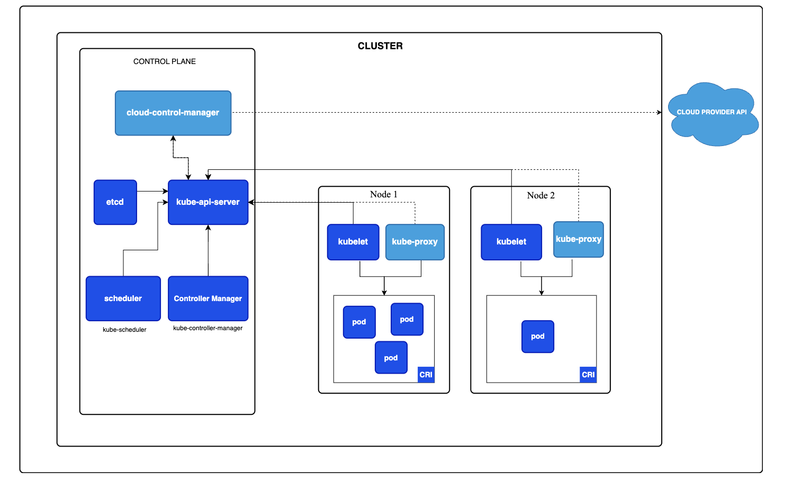

# Kubernetes

## Container Orchestration
- ***Auto scaling***: increase/decrease instances of service based on demand
- ***Service Discovery***: help microservices find another
- ***Load balancing***: distribute load among multiple instances of a microservice
- ***Self healing***: do health checks and if a service is down automatically replace failing instance
- ***Zero downtime deployments***: release new versions without downtime

## Container Orchestration Options
- AWS specific:
    - AWS Elastic Container Service
    - AWS Fargate (serverless version of AWS ECS)
- Cloud Neutral (meaning that Kubernetes solution can be found in any cloud provider) - Kubernetes
    - AWS: Elastic Kubernetes Service
    - Azure: Azure Kubernetes Service
    - GCP: Google Kubernetes Service

## Kubernetes Architecture

- Kubernetes can be tought as a "resource manager", Kubernetes manages your servers. 
- These servers are in cloud so they are called **virtual servers** (***node*** is used a term for these virtual servers)
- To manage thousands of Kubernetes nodes we have few ***master nodes***. (Typically you have only 1 master node but for availability this can be increased)
- ***Worker nodes***: 
    - also called as "nodes". 
    - Runs your application
- ***Master nodes manages worker nodes***: 
    - Ensure nodes are available
    - Doesn't have any application related containers
    - **If master node goes down, application still continue to run!!!**. Your application resides in **worker nodes**, thus your app will still be up. But since **master node** is down you can not make any changes to your **worker nodes**
- ***Cluster***: combination of ***worker nodes*** which are managed by ***master node***.

### Master Node Components
1. Distribute database (etcd):
    - All config, deployments created, scaling operations performed stored in here
    - It is recommended to have 3-5 replicas of this DB to prevent kubernetes cluster state from being lost
2. API Server: lets communication between: kubectl <-> kubernetes cluster, google cloud console <-> kubernetes cluster
3. Scheduler: 
    - Scheduling pods onto the nodes. 
    - When you create a pod, based on CPU/memory availability and other factors, the pod is scheduled to an appropiate node.
4. Controller manager:
    - manages overall health of cluster
    - make sure that actual state of kubernetes cluster matches the desired state

### Node / Worker Node Components
1. Pods: your apps run here
2. Node agent / kubelet: 
    - monitor the state of node and communicates back to master node
    - When a pod is down, node agent repost to controller manager of master node
3. Networking component / kube-proxy: lets you expose deployment as a service
4. Container runtime
    - Docker is commonly used, but any can be used
    - lets you run containers inside pods

## Getting Started
1. Go to `cloud.google.com` and create account
2. Search for `Kubernetes engine`, enable it
3. What is in our dashboard:
    - `Workloads`: you can manage the containers you want to deploy to cluster
    - `Gateway, Servies & Ingress`: give external world access to the apps in your cluster
4. Go to clusters and create cluster. Then go in your cluster
5. Click `Cloud Shell`
6. Go to `CONNECT` and copy the command you need in order to connect to your cluster: `gcloud container clusters get-credentials autopilot-cluster-1 --region europe-west10 --project hopeful-sound-421912`
7. You can now execute commands(`kubectl`) in order to interact with the cluster
8. Create a deployment using the image from docker:
`kubectl create deployment hello-world-rest-api --image=in28min/hello-world-rest-api:0.0.1.RELEASE`
9. Expose your app to the outside world: `kubectl expose deployment hello-world-rest-api --type=LoadBalancer --port=8080`
10. Go to `Gateway, Servies & Ingress`->`Services`: you will see your app here and now access it: `http://34.32.39.222:8080/` or `http://34.32.39.222:8080/hello-world`

## Concepts
- After deployment of an app run `kubectl get events`
```console
18m         Normal    Created                                  pod/hello-world-rest-api-5ffc8fdfb8-h8vzq                 Created container hello-world-rest-api
18m         Normal    Started                                  pod/hello-world-rest-api-5ffc8fdfb8-h8vzq                 Started container hello-world-rest-api
20m         Normal    SuccessfulCreate                         replicaset/hello-world-rest-api-5ffc8fdfb8                Created pod: hello-world-rest-api-5ffc8fdfb8-h8vzq
20m         Normal    ScalingReplicaSet                        deployment/hello-world-rest-api                           Scaled up replica set hello-world-rest-api-5ffc8fdfb8 to 1
18m         Normal    ADD                                      service/hello-world-rest-api                              default/hello-world-rest-api
18m         Normal    EnsuringLoadBalancer                     service/hello-world-rest-api                              Ensuring load balancer
18m         Normal    UPDATE                                   service/hello-world-rest-api                              default/hello-world-rest-api
18m         Normal    DNSRecordProvisioningSucceeded           service/hello-world-rest-api                              DNS records updated
17m         Normal    EnsuredLoadBalancer                      service/hello-world-rest-api                              Ensured load balancer
34m         Normal    DNSRecordProvisioningSucceeded           service/kubernetes                                        DNS records updated
32m         Normal    ADD                                      service/kubernetes                                        default/kubernetes
``` 
- You can view pods, deployment, replica set, service with generic command `kubectl get ...`. Ex: `kubectl get replicaset`
- ***Kubernetes uses single responsibility principle (SRP)***: one concept one responsiblity
- `kubectl create deployment ...`: creates deployment, replicaset and pod
- `kubectl expose dployment ...`: creates service

### Pods
- Smallest deployable unit in Kubernetes
- You cannot deploy a container without a pod in kubernetes. Containers live inside pods
- A pod can contain multiple containers. These containers share the resources of the pod. These containers can communicate with each other using local host.
- `kubectl get pods -o wide`
    - Each pod has a unique IP address
    - `READY` shows the number of containers running
- Get details of a pod: `kubectl describe pod hello-world-rest-api-5ffc8fdfb8-h8vzq`
    - In here you can see `Namespace`. It provides isolations for parts of the cluster from other parts of the cluster. If you have DEV and UAT environments running in the same cluster, you can seperate the resources of DEV and UAT by creating seperate namespaces for DEV and UAT and associate each of the resources with that specific namespace.
    - You can also see `Labels`. With **selectors** and **labels** you can pod, replica set, deployment, service.
    - `Annotations`: meta info

### Replica Sets
- Ensure that a specific number of pods are running at all times
- With `kubectl get replicasets`, you can see the number of desired pods, currently running pods and ready pods
- Exercise:
    1. See your pods `kubectl get pods -o wide`
    2. Delete one pod `kubectl delete pods hello-world-rest-api-5ffc8fdfb8-h8vzq`
    3. See your pods again `kubectl get pods -o wide`
    4. You notice that a node is running but the id different
    5. `Repica set` noticed that there are lesser number of pods than desired thus created new pod without resulting in downtime
- Increase the desired number of pods: `kubectl scale deployment hello-world-rest-api --replicas=3`
    - Wait few minutes and try to reach `http://34.32.39.222:8080/hello-world` repeteadly, you will see that the response is coming from different pods

### Deployment
- When upgrading your app from V1 to V2 you would want 0 downtime.
- Deploying a new version with incorrect image:
    1. Set the new version of your app to incorrect image
    ```shell
    kubectl set image deployment hello-world-rest-api #name of deployment
    hello-world-rest-api # container name
    =DUMMY_IMAGE:TEST
    ```
    `kubectl set image deployment hello-world-rest-api hello-world-rest-api=DUMMY_IMAGE:TEST`
    2. Even though we made a mistake with deployment, the app still runs perfectly: `http://34.72.205.109:8080/hello-world`!!
    3. `kubectl get rs -o wide`: this show that we have 2 replica set. The incorrect one has 0 ready container because the image is incorrect.
    4. `kubectl get pods -o wide`: shows that pod has incorrect image
    5. Our deployment command caused a new replica set to be created. Then 3 new pods is tried to be launched one by one from that replica set. However, at the first pod creation, encountered an error: image is incorrect. That's why we see 1 more replica set and 1 more pod, not 3 additional pods.
- Deploying a new version with correct image:
    1. `kubectl set image deployment hello-world-rest-api hello-world-rest-api=in28min/hello-world-rest-api:0.0.2.RELEASE`
    2. By searching replica set `kubectl get rs -o wide`, you can see that only running pods based on new correct image,
    3. `http://34.72.205.109:8080/hello-world` show "V2"
    4. Flow: create replica set for V2. Create a pod for V2. Delete pod from V1. Create a pod for V2. Delete pod from V1. Create a pod for V2. Delete pod from V1. `kubectl get events --sort-by=.metadata.creationTimestamp`

### Services
- Pods are "throw away unit" they go up and down. Irrespective of the pods we dont want consumer side to get affected.
- When a pod is deleted and new one is launched it receives a new IP. However, you can still reach the URL. This is because ***service***
- ***Service*** is responsible for providing always available external interface to the applications running inside pods. ***Service*** lets you application to receive traffic through a permanenet lifetime IP address.
- The service is created during `kubectl expose deployment ...`
- Go to `Gateway, Servies & Ingress`->`Services`->`hello-world-rest-api`: you will see all the pods serving for the service
- You can see how that specific service is implemented in Google Cloud: search for `Load balancing`